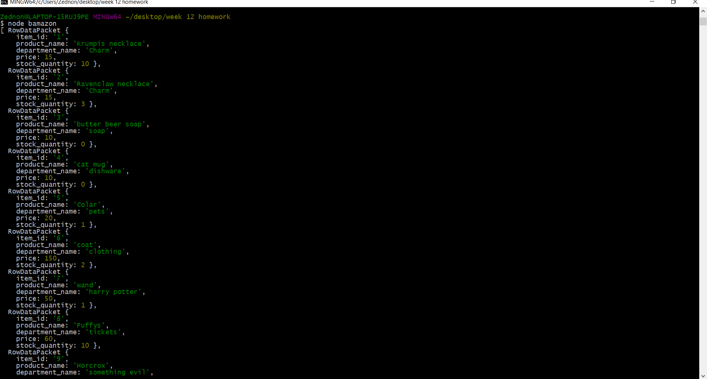
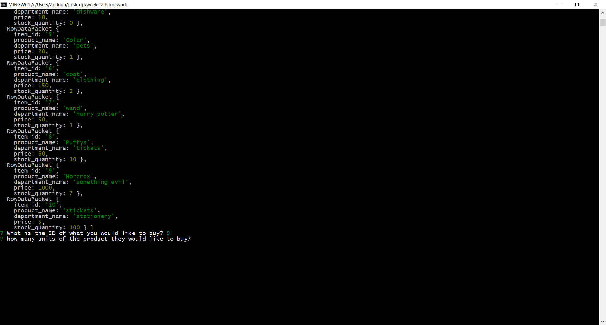
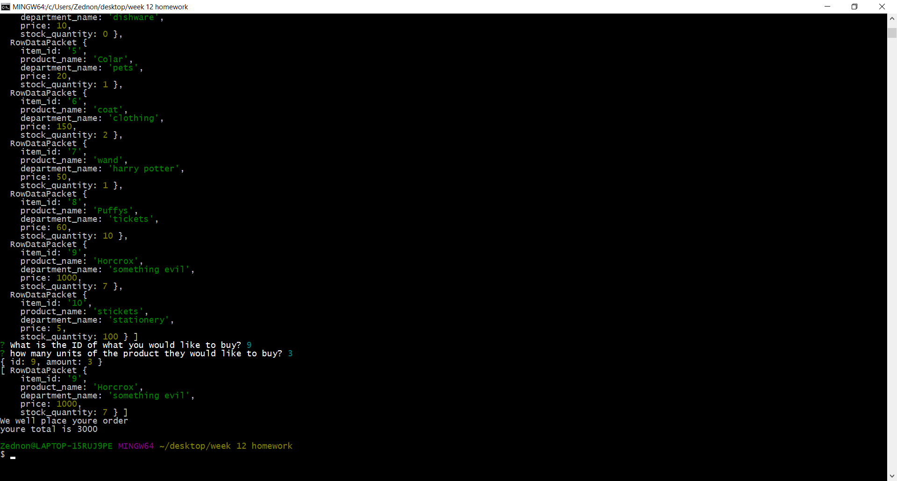
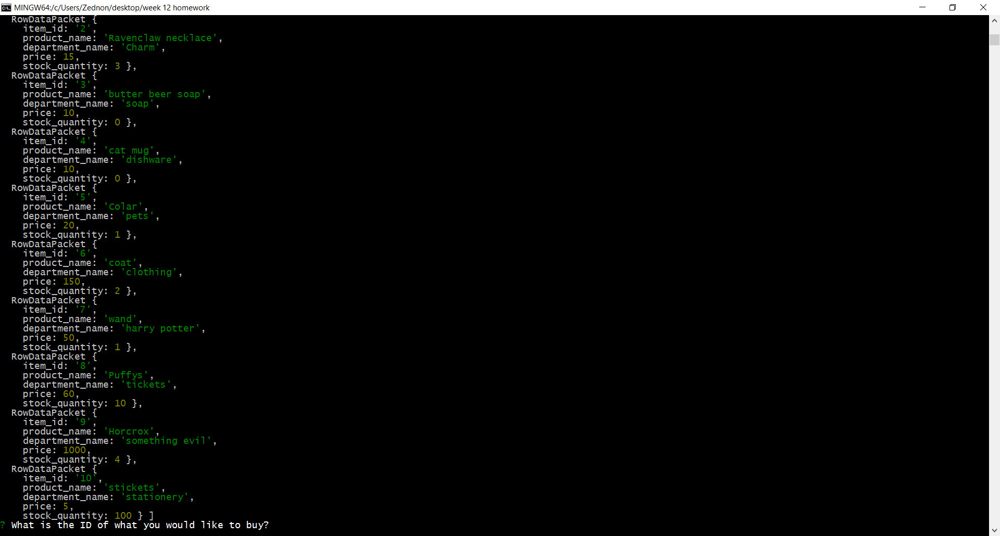
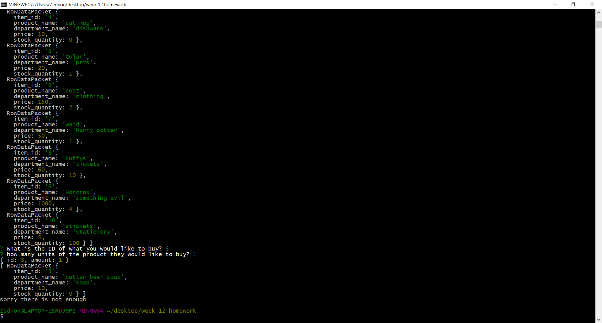

This App well allow the users to search a datebase and place a order. 

The listing of the database:

;

enter in the ID of the item, and the amount of the wanted item:

;

Order conformation and total:

;

Search data base and see there is a lower aviable number:

;

A message regarding there are not enought of the items to compect the order:

;